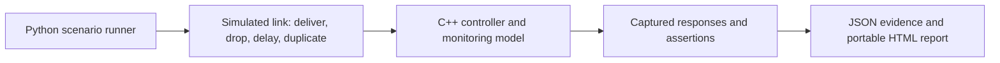

# Signal Bench

**A controller communication test bench that makes interrupted-message failures reproducible.**

An independent educational portfolio project for learning embedded C++, inspired
by published communication failures in cardiac-support systems. A compiled C++17
controller operates a virtual indicator. A Python runner drops requests and
acknowledgements, delivers delayed messages, and checks the resulting state.

The same tests run against a deliberately flawed implementation and a protected
implementation. The HTML report shows the actual messages, captured replies,
assertions, and state changes from those executions.

**Scope:** native software simulation using stdin/stdout pipes and virtual time.
No microcontroller, RTOS, electrical bus, medical device, patient data, or clinical
algorithm is involved. This project is not affiliated with BiVACOR or Abbott.

## Run it

Requirements: a C++17 compiler, Make, and Python 3.9 or newer. No packages, API keys,
cloud accounts, or board purchases are required. On macOS, the compiler and Make
come with the Xcode Command Line Tools. On Linux, use your distribution's C++
compiler and Make. Windows users can run the project in WSL; the Python transport
runner uses POSIX pipe readiness.

```sh
make demo      # Compile, execute tests, and generate reports/index.html
make serve     # Also start the report and local test runner
```

Open **http://127.0.0.1:8873** after `make serve`. Stop with Ctrl+C. If that port is
occupied, use `make serve PORT=8874`. The HTML file
`reports/index.html` is self-contained and can also be opened offline or shared
as an attachment. It contains captured evidence; replay animates that evidence.
The **Run tests** button is available only when using the local server.

## What to demonstrate

1. Select **Lost acknowledgement** in the report.
2. Inspect **Flawed implementation**. The device applies the command, its reply is
   dropped, and a retry executes the same command again. The execution counter
   exposes this even though setting the same indicator value looks harmless.
3. Switch to **Protected implementation**. The retry is acknowledged as a duplicate
   and the execution count stays at one.
4. Select **Delayed command after reconnect**. A new session invalidates commands
   from the earlier session, preventing a delayed setting from changing the output.
5. Click **Run tests**, or run `make demo`, to generate new evidence.

The baseline has two deliberately disabled guards (session validation and
duplicate-ID handling), caught by four scenarios. It is a teaching implementation,
not a reconstruction of any manufacturer's software bug.

## Verification

The suite has **18 scenarios**, executed against both modes, with **250 assertions**
in total. A successful suite requires all 18 protected scenarios to pass, exactly
the four expected flawed scenarios to fail, and no subprocess errors. This is a
bounded test set, not proof against every failure sequence.

```sh
make test
# Optional memory/undefined-behaviour checks on a compiler with sanitizer support:
c++ -std=c++17 -Wall -Wextra -Wpedantic -Werror -g \
  -fsanitize=address,undefined -fno-omit-frame-pointer \
  src/main.cpp -o build/controller-sanitized
python3 tests/run_tests.py --binary build/controller-sanitized \
  --output build/sanitized-results.json
```

`reports/results.json` includes the run timestamp, source hash, executable hash,
every captured exchange, and each expected/observed assertion. The report is a
snapshot: regenerate after editing source. Sanitizer output is separate so it
does not replace the normal report.

## Design



- `src/controller.hpp`: fixed-size controller and freshness-monitor state, with no
  OS dependencies or dynamic allocation in the core.
- `src/main.cpp`: bounded line parser and JSON response adapter for native tests.
- `tests/run_tests.py`: scenarios, simulated transport faults, independent expected
  outcomes, and evidence generation.
- `tools.py`: report generator and optional loopback-only development server.
- `web/`: report interface; it displays test evidence, not invented results.
- `docs/requirements.md`: requirements, protocol, and traceability.
- `docs/research.md`: primary-source motivation and limits of the inference.
- `docs/learning-guide.md`: beginner walkthrough and exercises.
- `docs/application-kit.md`: resume wording, a demo script, and an unsent email draft.

## Important design boundaries

The sender must use monotonically increasing, non-zero session IDs during one
controller process lifetime. They are not authentication tokens. IDs and state
are not persisted over device resets; replay protection across reboot is not
claimed. Only the latest command is eligible for a duplicate acknowledgement;
older IDs are rejected. Commands must be retried with identical IDs and payloads.

Telemetry freshness is measured from **receipt**, not sample acquisition. A
delayed but previously unseen sample could therefore look fresh. Source timestamps
and clock synchronisation would be a separate requirement.

`CLOCK` and `SAMPLE` are test-fixture inputs. Timing checks use virtual time and
do not measure hardware latency, scheduling jitter, electrical failures, or
real-time deadlines. Keeping an indicator level unchanged during link loss is a
requirement of this toy system, not a recommended medical-device response.

## Next hardware milestone

Keep the state logic and replace the native adapter with ESP32 firmware that reads
serial frames and controls an LED. Then replay the same scenarios over USB serial.
Measure timing on the real board and separately test reset behaviour. This port
has not been implemented or tested in the current project.

## Development and authorship

This initial implementation was created with AI assistance. Review the learning
guide, run the examples, and make changes you understand before describing your
personal contributions in an interview. Dependencies: C++ standard library,
Python standard library, and browser APIs only.
